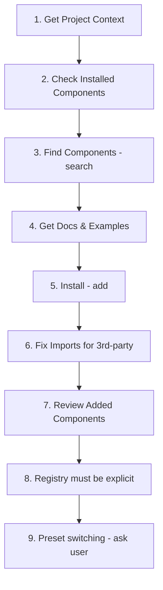

# shadcn/ui Skill — Phân tích & Hướng dẫn

> **1 skill, 5 rule files, CLI integration** — Dạy AI cách sử dụng đúng shadcn/ui components, patterns, và best practices.

## Tổng quan

**shadcn/ui skill** không giống các skill khác — nó không dạy triết lý thiết kế hay color theory, mà dạy AI cách **sử dụng đúng một component library cụ thể**. Nó inject project context (framework, installed components, aliases) vào mỗi lần AI tương tác.

| Thông tin | Chi tiết |
|-----------|----------|
| **Source** | [github.com/shadcn-ui/ui](https://github.com/shadcn-ui/ui) |
| **Docs** | [ui.shadcn.com/docs/skills](https://ui.shadcn.com/docs/skills) |
| **Stars** | 113k+ GitHub |
| **Type** | Component library skill (project-aware) |
| **Security** | Gen: Safe, Socket: 0 alerts, Snyk: Med Risk |

## Cài đặt

```bash
npx skills add shadcn/ui --yes --agent antigravity
```

Kết quả: `.agents/skills/shadcn/` — **12 files** trong 4 thư mục.

## Cấu trúc file

```
.agents/skills/shadcn/
├── SKILL.md                    ← Entry point (18KB) — rules + workflow + quick ref
├── cli.md                      ← CLI commands reference (17KB)
├── customization.md            ← Theming, CSS variables, variants (6KB)
├── mcp.md                      ← MCP server setup (2.5KB)
├── rules/                      ← 5 rule files (~23KB tổng)
│   ├── styling.md              ← Tailwind + semantic color rules
│   ├── forms.md                ← FieldGroup, Field, validation
│   ├── composition.md          ← Component structure patterns
│   ├── icons.md                ← data-icon, sizing
│   └── base-vs-radix.md        ← API differences (base vs radix)
├── assets/                     ← Logo files
│   ├── shadcn.png
│   └── shadcn-small.png
└── evals/                      ← Evaluation tests
```

## Nguyên tắc cốt lõi (4 Principles)

1. **Use existing components first** — `shadcn search` trước khi tự viết
2. **Compose, don't reinvent** — Settings = Tabs + Card + form controls
3. **Use built-in variants** — `variant="outline"`, `size="sm"` thay vì custom CSS
4. **Use semantic colors** — `bg-primary`, `text-muted-foreground`, KHÔNG `bg-blue-500`

## Critical Rules (Luôn bắt buộc)

### 🎨 Styling & Tailwind
| Rule | ✅ Đúng | ❌ Sai |
|------|---------|--------|
| Spacing | `flex flex-col gap-4` | `space-y-4` |
| Equal dimensions | `size-10` | `w-10 h-10` |
| Truncate | `truncate` | `overflow-hidden text-ellipsis whitespace-nowrap` |
| Dark mode | Semantic tokens | Manual `dark:` overrides |
| Conditional classes | `cn()` | Template literal ternaries |

### 📝 Forms & Inputs
| Pattern | Đúng |
|---------|------|
| Form layout | `FieldGroup` + `Field`, KHÔNG raw `div` |
| Input with button | `InputGroup` + `InputGroupAddon` |
| 2-7 options | `ToggleGroup`, KHÔNG loop `Button` |
| Validation | `data-invalid` on Field + `aria-invalid` on control |

### 🧩 Component Structure
| Pattern | Đúng |
|---------|------|
| Items grouping | `SelectItem` → phải trong `SelectGroup` |
| Overlays | Dialog/Sheet/Drawer luôn cần `Title` (a11y) |
| Card | Dùng full composition: Header/Title/Description/Content/Footer |
| Loading button | `Spinner` + `data-icon` + `disabled` |

### 🎯 Icons
| Pattern | Đúng |
|---------|------|
| In Button | `<Icon data-icon="inline-start" />` |
| Sizing | KHÔNG dùng `size-4` trong components |
| Passing | `icon={CheckIcon}` (object), KHÔNG string |

## Workflow (9 bước)



## Component Selection Guide

| Cần gì | Dùng gì |
|--------|---------|
| Button/action | `Button` with variant |
| Form inputs | `Input`, `Select`, `Combobox`, `Switch`, `Checkbox`, `RadioGroup` |
| Toggle 2-5 options | `ToggleGroup` + `ToggleGroupItem` |
| Data display | `Table`, `Card`, `Badge`, `Avatar` |
| Navigation | `Sidebar`, `NavigationMenu`, `Breadcrumb`, `Tabs`, `Pagination` |
| Modal overlay | `Dialog` (modal), `Sheet` (side), `Drawer` (bottom), `AlertDialog` (confirm) |
| Feedback | `sonner` (toast), `Alert`, `Progress`, `Skeleton`, `Spinner` |
| Command palette | `Command` inside `Dialog` |
| Charts | `Chart` (wraps Recharts) |
| Layout | `Card`, `Separator`, `Resizable`, `ScrollArea`, `Accordion` |
| Empty states | `Empty` |
| Menus | `DropdownMenu`, `ContextMenu`, `Menubar` |
| Tooltips | `Tooltip`, `HoverCard`, `Popover` |

## Preset System

### Named Presets
`nova`, `vega`, `maia`, `lyra`, `mira`, `luma`

### Templates
`next`, `vite`, `start`, `react-router`, `astro` (+ `--monorepo`), `laravel`

### Quick Commands
```bash
# New project
npx shadcn@latest init --name my-app --preset base-nova

# Apply preset to existing
npx shadcn@latest apply --preset a2r6bw

# Partial apply (theme only)
npx shadcn@latest apply --preset a2r6bw --only theme,font
```

## Tính năng đặc biệt: Project-Aware Context

Không giống các skill khác (static markdown), shadcn skill **chạy CLI mỗi lần tương tác**:

```bash
npx shadcn@latest info --json
```

Output chứa:
- `aliases` — Import prefix (`@/`, `~/`)
- `isRSC` — Có cần `"use client"` không
- `tailwindVersion` — v3 vs v4
- `style` — Visual treatment (nova, vega...)
- `base` — Primitive library (radix/base)
- `iconLibrary` — lucide, tabler, hugeicons...
- `resolvedPaths` — Exact file paths
- `framework` — Next.js, Vite, Astro...
- `packageManager` — npm, pnpm, bun

## So sánh với các skills khác

| Skill | Loại | Focus |
|-------|------|-------|
| `frontend-design` | Philosophy | Nguyên tắc thiết kế tổng quát |
| `impeccable` | Design system | 23 commands cho mọi khía cạnh design |
| `theme-factory` | Color presets | 10 bộ theme sẵn |
| `brand-guidelines` | Brand tokens | Anthropic brand identity |
| `canvas-design` | Visual art | Poster/PDF creation |
| `figma-implement-design` | Workflow | Figma → Code pipeline |
| **`shadcn`** | **Component library** | **Rules + patterns cho UI components** |

> **Vị trí duy nhất**: shadcn là skill **component-level** duy nhất — nó không dạy design philosophy mà dạy **cách implement đúng** với một library cụ thể.

## Ghi chú sử dụng

- Skill này hữu ích nhất khi project thực sự dùng shadcn/ui
- Nó tự động detect `components.json` trong project
- Có thể kết hợp với `impeccable` — impeccable lo design, shadcn lo implementation
- MCP server riêng cho component search/install
